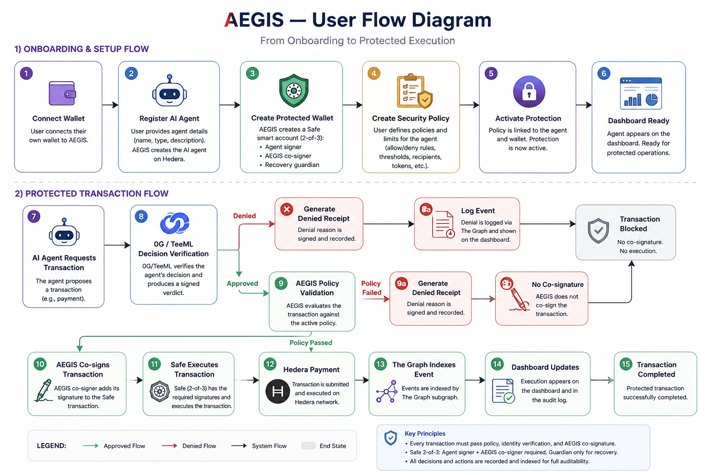
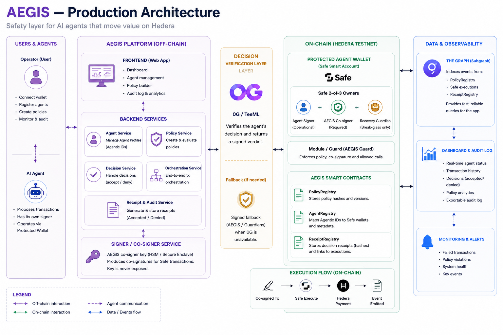
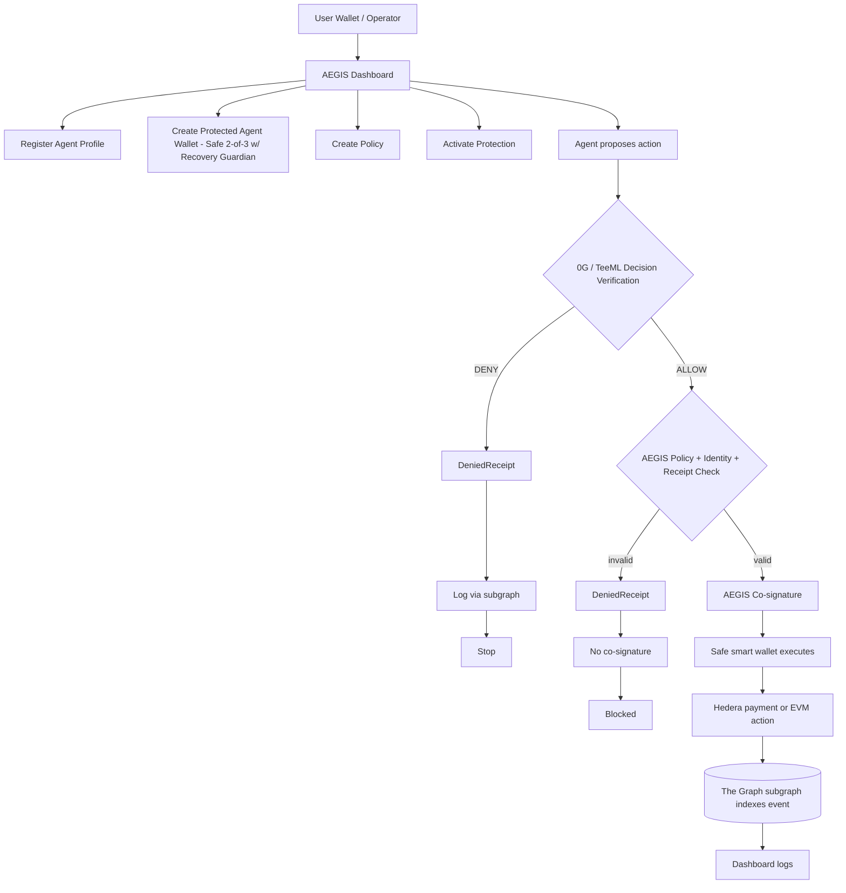

# AEGIS — Production Architecture

## 1. Product thesis

AEGIS is a safety layer for agents that move value.

AEGIS creates the AI agent itself, built on Hedera, as part 
of onboarding. Either way, AEGIS wraps the agent in a **protected
operational wallet**, bound to it, where every transaction must pass through:

1. a policy defined by the user;
2. verification of the agent's identity;
3. a verdict/receipt validated by real 0G/TeeML evidence;
4. an objective check of the transaction;
5. AEGIS co-signature;
6. execution via the Safe smart wallet;
7. a record in the dashboard/log, backed by The Graph.

In plain language:

> The user grants operational power to an agent — created by AEGIS on Hedera
> today, bring-your-own later — but that agent never gets a free-spending
> key. It gets a protected wallet that can only act if the policy, the
> decision, the identity, and the co-signature all line up.

---

## 2. Production clarifications

A few terms from the original brainstorm need to be pinned down precisely so
they don't create risk or confusion.

### 2.1 "Create a wallet by exposing a private key"

**Must never mean exposing the AEGIS private key.**

The safe version is:

- The application creates and configures a **Safe smart account** for the
  agent.
- The user must retain control of, or a recovery path over, that wallet.
- The user's key or the agent wallet's key is never shown outside an
  intentional export/recovery flow.
- The AEGIS/co-signer private key is **never accessible to the user**.
- A "break-glass recovery" flow, if triggered, deactivates the current
  protected wallet and forces migration to a new one.

> The user creates or links an operational wallet for the agent. AEGIS never
> exposes the platform's private key. If the agent's key is ever
> exported/recovered, that kills the current protected wallet and requires
> migration.

### 2.2 Agentic ID vs. ERC-4337

**Agentic ID and ERC-4337 are not the same thing.**

- **Agentic ID / Agent Profile:** the agent's logical identity — metadata,
  name, capabilities, status, policy hash, and logs. AEGIS-native (§5.4), not
  ENS-based.
- **Safe (ERC-4337-compatible) smart account:** the programmable wallet used
  for protected execution.

> Protecting an agent links an Agent Profile/Agentic ID to a Safe smart
> account. The Agentic ID identifies; the Safe executes.

### 2.3 "Sign Accepted or Denied"

AEGIS does not need to sign a rejected transaction for it to be blocked.
Blocking can simply mean withholding the required co-signature.

But it does make sense to sign/log a **Denial Receipt** for audit purposes.

- **Accepted Receipt:** enables co-signature and execution.
- **Denied Receipt:** records the rejection code, appears in the dashboard,
  does not execute.

### 2.4 "Only accept with our private key too"

The correct model is **co-signature**, not exposing the AEGIS key.

The normal flow requires two authorizations:

1. the agent/user signer;
2. the AEGIS co-signer.

Implemented as a Safe 2-of-3: the agent/user signer and the AEGIS co-signer
are required for routine execution; the recovery guardian is the third
owner, reserved for break-glass recovery (§3.3, §9.3), not day-to-day
signing. Module/guard-enforced.

### 2.5 "If we get hacked, no transaction can happen"

This is a real bottleneck. Since AEGIS holds the co-signature, AEGIS can
become a single point of failure — and now that the co-signer is a real Safe
owner  this risk is live from day one, not deferred to a later
production phase.

Mitigation:

- AEGIS always runs locally — there is no centralized, third-party-hosted
  service holding the co-signer key on the user's behalf.
- An **Emergency Recovery / Break-glass Flow** must exist.
- The user never gets access to the AEGIS private key.
- The user always has a recovery path to migrate funds to another wallet, via
  2FA/timelock/admin action — this is not conditional.
- The moment the co-signer's private key is exposed, the wallet immediately
  stops being reported as "Protected by AEGIS" — that exposure is what
  triggers break-glass, not a separate manual decision.

---

## 3. User flow — fully explicit



### 3.1 Onboarding

1. User opens AEGIS.
2. Clicks **Connect Wallet**.
3. Connects the operator's own wallet.
4. The app shows the empty dashboard: "No protected agents yet."
5. User clicks **+ Protect Agent**.

### 3.2 Create agent

The user fills out a form:

- `Agent name`: e.g. `TreasuryBot`.
- `Agent type`: Payment / API Buyer / DeFi / Treasury / Other.
- `Agent endpoint`: optional.
- `Agent description`: short description.

There is no `Agent signer` input field. Clicking **Create Agent** has AEGIS
create the agent itself using the Hedera SDK — including its own Hedera
account, the future Agent Signer owner on the Safe wallet (§3.3) — together
with its **Agent Profile** (§5.4). The new agent is linked to the user's own
connected wallet (§3.1) from the moment it's created — the Agent Profile
records that owning `OperatorWallet` address, so an agent always belongs to
the user who created it.

### 3.3 Create the agent's protected wallet

The user clicks **Create Protected Wallet**.

This always creates a **Safe smart account**:

- Owners/signers:
  - Agent/user signer;
  - AEGIS co-signer;
  - Recovery guardian.
- Threshold: 2-of-3. Routine protected execution always requires the
  agent/user signer + the AEGIS co-signer — the guardian never signs
  day-to-day transactions.
- Emergency recovery: if the agent/user signer or the AEGIS co-signer is ever
  unavailable or compromised, the guardian co-signs with the remaining party
  to still reach 2-of-3 and migrate — via a separate flow with
  timelock/2FA.
- Deployed to Hedera testnet (or the target EVM chain); the contract and owner structure are the same ones used in production.

### 3.4 Create policy

The user clicks **Create Policy**. Form fields:

- `Allowed destinations`: addresses/IDs of approved providers.
- `Allowed tokens`: HBAR, USDC, etc.
- `Min amount`: optional.
- `Max amount`: cap per action.
- `Max daily amount`: optional.
- `Deadline`: how long the policy is valid.
- `Nonce`: generated automatically.
- `Action type`: payment / API call / service payment / transfer / DeFi
  action.
- `SLA required?`: yes/no.
- `SLA deadline`: if an external service is involved.

Clicking **Create Policy** generates:

- a `policyHash`;
- off-chain metadata;
- a persisted offchain policy record and deterministic `policyHash`; only real
  sanitized references emitted by an onchain producer are later indexable;
- a dashboard view.

### 3.5 Activate protection

The user clicks **Activate Protection**. The dashboard shows:

- active agent;
- active policy;
- protected wallet;
- `Protected by AEGIS` status;
- empty or initial logs, backed by the subgraph (§5.3).

---

## 4. Transaction execution flow

### 4.1 Agent proposes a transaction

The real or simulated agent proposes an action:

```json
{
  "agentId": "treasurybot",
  "actionType": "PAY_SERVICE_PROVIDER",
  "destination": "0.0.serviceProvider",
  "token": "HBAR",
  "amount": "1",
  "semanticContext": "Pay approved API provider for market data",
  "policyHash": "0x...",
  "nonce": 12,
  "deadline": "2026-07-26T08:00:00Z"
}
```

### 4.2 0G/TeeML verifies the decision

0G/TeeML's role is not "holding the money." Its role is verifying the agent's
decision in a trusted, attestable environment.

Calling 0G Compute for this verification is itself a paid transaction on the
0G network — AEGIS pays that cost, not the user or the agent. It's an
operating cost of running the platform, covered by AEGIS's own fee revenue
(§8). The agent/user never sees or pays a 0G bill directly.

Input to 0G/TeeML:

- policy;
- proposed action;
- private semantic context, passed directly and not persisted;
- agent identity;
- business rule.

Expected output:

- `ALLOW` or `DENY`;
- `reasonCode`;
- `receiptHash`;
- `proofRef` / `ogRef`;
- execution metadata.

If 0G/TeeML returns `false`/`DENY`, the action stops before execution is
attempted.

There is no local-verdict fallback. If private routing, TEE verification,
schema validation, or commitment verification is unavailable, AEGIS does not
write a final TeeML registry verdict. Technical failures remain offchain and
must never be presented as verified 0G evidence.

### 4.3 Decision Receipt

After the decision, AEGIS generates a **Decision Receipt**.

Minimum fields:

```json
{
  "agentId": "treasurybot",
  "wallet": "0xAgentSafe",
  "policyHash": "0xPolicy",
  "actionHash": "0xAction",
  "destination": "0.0.serviceProvider",
  "token": "HBAR",
  "amount": "1",
  "chainId": "hedera-testnet-or-evm-chain-id",
  "nonce": 12,
  "deadline": "2026-07-26T08:00:00Z",
  "verdict": "ALLOW",
  "reasonCode": "DESTINATION_AND_AMOUNT_APPROVED",
  "semanticContextHash": "0x...",
  "proofRef": {
    "provider": "0G",
    "mode": "private-tee-verified",
    "receiptHash": "0x...",
    "artifactHash": "0x...",
    "timestamp": "ISO-8601"
  },
  "signature": "0x..."
}
```

### 4.4 AEGIS's final check

Even if 0G returns `true`, AEGIS still checks objectively:

- agent identity;
- `policyHash`;
- amount;
- token;
- destination;
- deadline;
- nonce;
- `actionHash`;
- receipt signature;
- protected wallet status;
- protocol fee.

If anything fails:

- generate a `DeniedReceipt`;
- withhold co-signature;
- log the reason code;
- update the dashboard (via the subgraph, §5.3).

If everything passes:

- generate an `AcceptedReceipt`;
- as part of generating that receipt, AEGIS modifies the underlying Safe
  transaction itself — turning it into a batch that pays the approved
  `destination` **and** sends AEGIS's fee slice in HBAR in that same
  execution, not as a separate follow-up transaction;
- co-sign that batched transaction;
- execute it via the Safe smart wallet;
- update the dashboard (via the subgraph, §5.3).

### 4.5 Co-signature and Safe

The transaction only executes with:

1. the agent/user's signature;
2. the AEGIS co-signer's signature.

This is enforced by the Safe module/guard on the 2-of-3 account — not
simulated. It prevents:

- the agent executing outside the platform using the same protected wallet;
- AEGIS missing its fee when execution bypasses the service;
- duplicate transactions outside the controlled flow;
- execution without a policy/receipt.

It also creates a risk: AEGIS becomes a critical co-signer. Mitigation:
recovery path, timelock, signer rotation, migration fallback, real key
management (§2.5, §9.2).

---

## 5. Where each partner fits

### 5.1 0G

**Role in the product:** verifier of the agent's decision.

The goal is to use 0G/TeeML to prove the verdict wasn't invented freely by an
ordinary backend.

**Where it enters the flow:**

- After the agent proposes the action.
- Before AEGIS co-signature.
- Before execution via the Safe wallet.

**What must exist:** a real private 0G call/artifact, verified TEE/schema/hash
evidence, and a receipt tied to the action. If verification is unavailable or
invalid, the flow remains technically failed/pending; no local verdict or
declared fallback is permitted.

### 5.2 Hedera

**Role in the product:** payment/financial-operation rails.

**Where it enters the flow:** when the approved action involves paying a
service/API provider; can execute an HBAR transfer on testnet; can later
support x402/escrow/SLA. The same batched Safe transaction that pays the
provider also pays AEGIS's fee — both are HBAR transfers settled on Hedera in
one execution (§4.4, §8).

**What must exist:** a real HBAR testnet transfer; a provider account; a
tx id/link; the AEGIS fee slice landing in the AEGIS fee account as part of
that same transaction; payment triggered by the approved flow, not manually;
dashboard logs.

### 5.3 The Graph

**Role in the product:** indexing layer for everything the dashboard and
audit log display. Promoted from a "cut if late" stretch item to core
infrastructure — the dashboard does not scan raw RPC logs in production.

**Where it enters the flow:**

- Indexes the singleton `AegisTeeValidationRegistry` after its real deployment.
- Indexes real Safe execution success/failure and configuration events after a
  Safe is discovered; these events do not invent business amount/destination.
- Indexes the verified 0G Agentic ID event surface in a separate network-specific
  Subgraph without private/decrypted metadata.
- The dashboard and audit views read from the Subgraphs via GraphQL instead of
  re-deriving history from raw logs on every page load.

**What must exist:**

- separate Hedera and 0G manifests covering only verified real event ABIs;
- self-hosted Graph Node deployments while the selected networks are not
  available for this deployment mode on The Graph Network;
- dashboard queries pointed at the subgraph, with a documented cache/lag
  tolerance (see §9.7).

---

## 6. Architecture diagram



The diagram above is the detailed system view (services, contracts, signer
custody, indexing). The flowchart below is the condensed request-path view of
the same system, kept in Mermaid so it stays diffable in git:



---

## 7. Technical modules

| Module | Responsibility | Production shape |
|---|---|---|
| `OperatorWallet` | the user's own wallet | wagmi/RainbowKit-connected wallet; multisig/DAO optional later |
| `AgentProfile` | agent identity and private/offchain metadata | AEGIS API record linked to the owning `OperatorWallet`; public Agentic ID facts are read from the 0G Subgraph |
| `ProtectedAgentWallet` | the agent's operational wallet | Safe smart account, 2-of-3 (agent signer + AEGIS co-signer + recovery guardian; guardian only signs for recovery) |
| `PolicyEngine` | stores/evaluates policy constraints and deterministic `policyHash` | private/offchain Level 1 service; The Graph exposes only real onchain hash references |
| `AegisTeeValidationRegistry` | stores sanitized verified TeeML facts once deployed | singleton Hedera EVM contract with immutable request idempotency and role-gated recorder |
| `VerifiedTeeMlRegistryWriter` | accepts already verified 0G evidence | verification-gated adapter in `services/agent-service`; no local-verdict fallback |
| `AegisCosigner` | signs accepted/denied receipts | one AEGIS-operated key across every deployment/user (§9.2); always-local, never third-party-hosted; path to local HSM/MPC/TEE |
| `SafeExecutionLayer` | requires both routine signatures | Safe Guard/Module enforcing 2-of-3 plus an on-chain 0G attestation before execution (§9.2); guardian reserved for recovery |
| `HederaPaymentExecutor` | pays the provider | HBAR transfer on testnet; path to x402/HTS/escrow |
| `IndexingLayer` | serves confirmed onchain history to the dashboard | separate Hedera and 0G Subgraphs queried through typed GraphQL; no RPC/database fallback |

---

## 8. Fees and monetization in the final flow

AEGIS can monetize directly in the execution path.

- **Fee per green action** — charged when an action is approved and executed.
  Collected atomically: generating the `AcceptedReceipt` (§4.4) modifies the
  Safe transaction into a batch that pays the destination and AEGIS's HBAR
  fee slice in the same execution, not a separate billing step.
- **Dashboard/API** — operators pay to manage policies, logs, alerts, and
  multiple agents.

---

## 9. Bottlenecks and limitations

### 9.1 An exposed private key is a critical risk

Never expose the AEGIS key. If the agent's key must ever be exported, that
kills the current protected wallet and requires migration.

### 9.2 The AEGIS co-signer becomes a critical point

If the local AEGIS co-signer is hacked, goes down, or censors, execution
stalls. There's no centralized fallback instance to fail over to — it always
runs locally. Mitigations: local HSM/MPC/TEE key custody, signer rotation,
emergency recovery, timelock, and an always-available migration path so the
user is never stuck.

The co-signer key is centralized — it belongs to AEGIS, not the user — and it
signs on a server AEGIS runs itself, not a shared third-party service. The
Safe's Guard/Module (§7, `SafeExecutionLayer`) requires a verifiable 0G
attestation on-chain before allowing execution, so the co-signer's signature
alone — even paired with the agent's — isn't sufficient without it.

### 9.3 A stuck signer can lock the user out

A plain 2-of-2 would be bad if either signer becomes unavailable — that's why
the wallet is 2-of-3 with a recovery guardian (§3.3), not plain 2-of-2: if
the agent/user signer or the AEGIS co-signer is stuck, the guardian steps in
to reach 2-of-3 and migrate. A timelocked escape hatch and a paused/migration
mode still apply as backstops if the guardian is also unavailable. This is a
live production risk from day one, not a deferred "once we use real Safe"
concern — Safe is already the wallet layer.

### 9.4 0G/TeeML can delay the demo

The real TeeML E2E may remain incomplete, but a locally signed verdict is not
an acceptable substitute. Contract/indexing plumbing may use an explicitly
labelled authorized test record that is never presented as real TeeML.

### 9.5 Hedera can end up manual

The transfer must be triggered by the agent's flow, not a separate manual
button.

### 9.6 No full cross-chain atomicity

If the EVM vault and the Hedera payment are separate, the MVP does not
guarantee full atomicity. This must be stated explicitly.

### 9.7 Subgraph indexing lag

The Graph indexes asynchronously — there's a delay (usually seconds, but not
zero) between an on-chain event and its availability in a subgraph query. The
dashboard should not assume Graph reads are real-time: show an optimistic
"pending" state right after a transaction, backed by the transaction receipt,
and reconcile with the subgraph once indexed. Don't block the co-signature/
execution path on subgraph state — only the read/history side depends on it.

---

## 10. Possible failure modes

- **0G approves a bad decision** — if the action respected the policy, that's
  a bad judgment call, not an objective failure of AEGIS's checks; the policy
  did its job by allowing it.
- **User misconfigured the policy** — if the user allowed a bad
  destination/amount, AEGIS should not assume unlimited liability.
- **AEGIS co-signer compromised** — high risk; mitigate with key management,
  rotation, and emergency shutdown.
- **Provider doesn't deliver the service** — a real failure mode outside
  AEGIS's control; AEGIS does not compensate for it.
- **Agent tries to execute outside the platform** — blocked if the protected
  wallet requires AEGIS co-signature; out of scope if the agent has a
  separate wallet outside AEGIS entirely.
- **User leaks the Agent Wallet key** — the Safe co-signature limits the
  damage, since the key alone can't execute a protected green action.
- **AEGIS goes down** — transactions stop; recovery/migration must exist.

---

## 11. Recommended demo

1. User connects wallet.
2. Clicks **+ Protect Agent**.
3. Registers `TreasuryBot`.
4. Creates the agent's Safe wallet.
5. Creates a policy: approved provider; HBAR; max 1 HBAR; deadline; nonce.
6. Agent proposes paying the approved provider.
7. Real 0G/TeeML evidence is verified and returns `ALLOW`; otherwise this demo
   step remains incomplete rather than using a fallback verdict.
8. AEGIS checks policy/receipt and co-signs.
9. The Safe wallet executes.
10. The Hedera HBAR transfer happens.
11. The Graph subgraph indexes the event; the dashboard shows a green action +
    fee within seconds.
12. Agent proposes paying a disallowed destination or a larger amount.
13. 0G/AEGIS returns `DENY` or the objective check fails.
14. AEGIS withholds co-signature.
15. The dashboard shows a blocked action (again via the subgraph).

---

## 12. One-line summary

> AEGIS registers an agent, creates a Safe-based protected wallet, applies
> user-defined policies, uses 0G/TeeML to verify the agent's verdict, requires
> AEGIS co-signature via that Safe wallet, and executes auditable payments
> indexed by The Graph.

---

## 14. Standing truths for this project

- AEGIS is not just a simple Safety Vault.
- AEGIS is an **Agent Protected Wallet (Safe) + Policy Gate + 0G Decision
  Verification + AEGIS Co-signature + Graph-indexed Dashboard**.
- AEGIS creates the AI agent itself, built on Hedera, as part of onboarding
  in this version; connecting a user's own external agent is a roadmap item,
  not shipped now.
- AEGIS never exposes its private key.
- The protected wallet requires co-signature to prevent execution outside the
  platform.
- 0G/TeeML validates the verdict/decision; it does not hold funds.
- The Safe smart wallet holds execution.
- The Graph indexes the history that the dashboard and audit log are built
  on — not raw log-scraping, not ENS.
- AEGIS does not provide coverage, insurance, or compensation for
  counterparty failures. It prevents unauthorized or non-compliant execution;
  it does not remediate after the fact.
