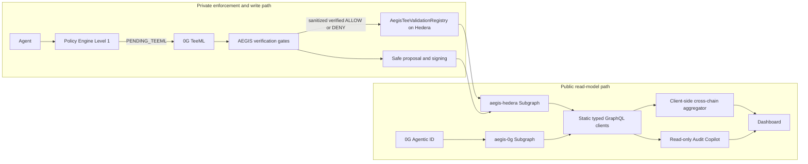

# AEGIS onchain read-layer architecture

## Decision record

AEGIS is a pre-transaction security layer for agents. Policy evaluation, private TeeML execution, TEE and schema verification, signing, and Safe execution remain on the write/enforcement path. The Graph is not part of that critical path.

Confirmed and historical onchain state shown by the dashboard follows one invariant:

> **self-hosted Graph Node -> Subgraph GraphQL -> dashboard**

The dashboard must not reconstruct confirmed history through JSON-RPC, Hedera Mirror Node, explorer scraping, direct contract reads, or the AEGIS operational database. Wallet connection, write transactions, and a short-lived optimistic or pending state are allowed. After confirmation, the read model reconciles through The Graph.

The decision to use a self-hosted Graph Node for live Hedera and 0G testnet data is final for this project:

> **Graph Node self-hosted eligibility: HUMAN-CONFIRMED / RESOLVED**

This branch does not claim publication to The Graph Network.



## One registry deployment, many immutable records

`packages/foundry/contracts/AegisTeeValidationRegistry.sol` is a singleton, non-upgradeable Hedera EVM registry. It is not TeeML. Its purpose is to make final, already verified TeeML results public, sanitized, immutable, and indexable.

- `DEFAULT_ADMIN_ROLE` controls recorder membership.
- `RECORDER_ROLE` is required to record a validation.
- The constructor assigns authority to the configured final admin and recorder; an unrelated deployer retains no role.
- Each non-zero `requestId` may be recorded once. A duplicate reverts and no update/delete function exists.
- Only fixed-size hashes, public addresses, unsigned integers, schema version, and the `ALLOW`/`DENY` enum are accepted.
- The caller cannot supply a timestamp. The mapping uses `event.block.timestamp`.
- `TEEML_FAILED`, fallback decisions, unverified output, plaintext semantic context, prompts, reasons, or raw attestations are never registered as a verified verdict.

The exclusive deploy environment is the repository-root file named exactly `tee-smartcontract-validation`. The runtime service does not load it. The loader, deployer, verifier, and public artifact writer are implemented, but the real file is currently absent; therefore no registry address, transaction, block, or public deployment artifact is claimed. This external step is `TG-DEPLOY-001`.

The typed runtime boundary is `VerifiedTeeMlRegistryWriter.recordVerifiedVerdict(...)` in `services/agent-service/src/teeml-registry/`. It accepts only a verified evidence input. Wiring the real TeeML producer remains `TG-TEEML-E2E-001` and cannot be satisfied with a local or mocked verdict.

## Two Subgraphs

A Subgraph indexes one network. Cross-chain correlation is performed in the GraphQL client, never in AssemblyScript mappings.

### Hedera Subgraph

`subgraphs/aegis-hedera/` is generated from `deployments/hedera-testnet/tee-validation-registry.json`. Generation rejects a missing artifact, a zero address, an invalid chain ID, or an absent start block and verifies the exact registry event ABI.

The schema and mappings support:

- immutable `TeeMLValidation` facts;
- agent, Safe, policy-reference, protocol, and daily metric projections derived from the registry event;
- Safe `ExecutionSuccess`, `ExecutionFailure`, `AddedOwner`, `RemovedOwner`, and `ChangedThreshold` events emitted after a Safe is discovered from a registry record;
- immutable event IDs built from transaction hash and log index.

Safe discovery is intentionally forward-only. It cannot recover Safe history before the first registry event that names that Safe. Safe success/failure proves a Safe execution result and reimbursement field, but not an AEGIS business payment's asset, destination, or amount. There is no current sanitized producer event for business payment, policy lifecycle, fee, or AEGIS execution semantics. That source gap is `TG-EVENTS-001`; no database or RPC fallback fills it.

### 0G Subgraph

`subgraphs/aegis-0g/` indexes the verified Agentic ID contract:

- contract: `0x2700F6A3e505402C9daB154C5c6ab9cAEC98EF1F`;
- deployment transaction: `0xbdd5f9d5c4f3086c814e02be0757650f553a02a46f0341e6dea96d1eed2f7557`;
- deployment block: `23544364`;
- verified source repository commit: `fd3c58306bf45c42888d4acda949bac0d3d64522`.

The compiled, metadata-stripped runtime matches the live runtime. The versioned ABI is a **minimal fixed-width event ABI**, not a full application ABI. It indexes the verified events `Transfer`, `UsageAuthorized`, `UsageRevoked`, and `DelegateAccessSet`. The dynamic-string `IntelligentDataSet` event is intentionally excluded so no descriptive or private content enters the Subgraph. Provenance and hashes are in `subgraphs/aegis-0g/config/agentic-id.json`.

This source begins at the verified contract deployment block and can cover the configured registry history. It does not imply that every indexed registry identity belongs to AEGIS. AEGIS linkage requires an explicit documented join key. Recovery of the deployment provenance and useful event surface completes `TG-AGENTIC-ID-001`.

## Self-hosted Graph Node and Hedera source stack

`compose.thegraph.yaml` runs Graph Node `v0.44.0`, dedicated PostgreSQL, IPFS, and Hiero JSON-RPC Relay `v0.78.1`. Persistent state is isolated from the operational AEGIS database, and all published ports bind to loopback by default.

The public-Mirror-backed Hiero relay passes process readiness but fails the strict Graph Node source contract: transactions listed in recent blocks can be absent through `eth_getTransactionByHash`, and transaction/receipt/block provenance cannot be proved repeatably. Retries, ignored receipts, disabled checks, and Hashio fallback are forbidden.

The required Hedera source path is:

```text
dedicated Hiero Mirror Node v0.159.1 for Testnet
  -> read-only Hiero JSON-RPC Relay v0.78.1
  -> self-hosted Graph Node v0.44.0
  -> aegis-hedera GraphQL endpoint
```

`scripts/thegraph/preflight.sh` validates chain ID, repeated blocks, transaction-by-hash, repeated receipts, receipt block hash/number, exact-block logs, historical log ranges, latest code, deployment provenance, and the configured start block. It ends Hedera validation with exactly `HEDERA_GRAPH_RPC_READY` or `HEDERA_GRAPH_RPC_BLOCKED`. Replacing the public backing service with a consistent dedicated Mirror Node is `TG-HEDERA-RPC-001`.

Container health is not synchronization evidence. The deployment gate also requires Graph Node indexing status, `_meta`, no fatal/indexing errors, and a real GraphQL result.

## GraphQL, aggregation, and dashboard

The dashboard uses server-side GraphQL clients for the Hedera and 0G endpoints. Documents are static, user filters are variables, timeouts and page sizes are bounded, and a Gateway key is server-only when one is applicable. Every page exposes source network, transaction hash, block, timestamp, `_meta` freshness, indexing errors, and partial-source state.

The cross-chain aggregator uses only canonical public keys described in `cross-chain-join.md`. It returns complete, 0G-only, Hedera-only, mismatch, ambiguous, or stale results without inventing a relation.

The Audit Copilot is a live, read-only 0G minimum product, not a free-form chatbot. It maps a bounded natural-language question to allowlisted static GraphQL operations and refuses an answer without indexed entity and transaction evidence. Its current 0G intents cover registry summary, recent identities, owner activity, ownership changes, usage authorizations, and delegation changes. All six were proven through the HTTP route against the synchronized real Subgraph with citations and fresh `_meta`; an attempted private-TeeML question was rejected. Hedera-backed validation and execution analyses remain `TG-AUDIT-COPILOT-001`, contingent on live Hedera entities rather than mock data.

## Privacy boundary

Allowed public fields are fixed hashes, structured verdict/status enums, public addresses, token IDs, schema version, recorder, and transaction/log/block/timestamp references.

The registry, Subgraphs, GraphQL layer, evidence, dashboard, and Audit Copilot must never receive prompts, complete semantic rules, semantic-context plaintext, detailed agent reasons, raw TeeML output, raw private proof/attestation, private/decrypted metadata, application database rows, private keys, API/auth tokens, or two-factor secrets.

## Remaining dependency boundary

The core implementation is independently testable. Remaining external work is narrow and tracked in `docs/handoffs/THEGRAPH_INTEGRATION_CONTINUATION.md`:

| Task | External dependency | What it gates |
| --- | --- | --- |
| `TG-DEPLOY-001` | Locally supplied dedicated deploy environment and funded deployer | Real singleton registry deployment, artifact, test record, and Hedera manifest. |
| `TG-HEDERA-RPC-001` | Dedicated Testnet Mirror Node data stack | Safe Hedera Graph Node ingestion and live Hedera GraphQL. |
| `TG-TEEML-E2E-001` | Real private, TEE-verified TeeML artifact producer | Real TeeML -> registry -> Subgraph E2E only. |
| `TG-EVENTS-001` | Sanitized business event producer | Business payment/execution/policy views. |
| `TG-AUDIT-COPILOT-001` | Live Hedera entities from the tasks above | Hedera-backed Copilot intents. |

No remaining task authorizes fabricated events, placeholder deployment data, runtime fixtures, or an alternate confirmed-read path.
